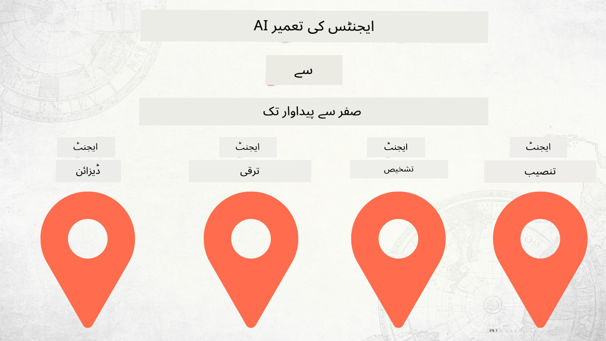

<!--
CO_OP_TRANSLATOR_METADATA:
{
  "original_hash": "df86a71d9a4a65d134d60f783a2aba86",
  "translation_date": "2025-12-18T14:18:06+00:00",
  "source_file": "README.md",
  "language_code": "ur"
}
-->
# زیرو سے پروڈکشن تک AI ایجنٹس کی تعمیر

### 🌐 کثیراللسانی معاونت

#### GitHub ایکشن کے ذریعے معاونت (خودکار اور ہمیشہ تازہ ترین)

<!-- CO-OP TRANSLATOR LANGUAGES TABLE START -->
[Arabic](../ar/README.md) | [Bengali](../bn/README.md) | [Bulgarian](../bg/README.md) | [Burmese (Myanmar)](../my/README.md) | [Chinese (Simplified)](../zh/README.md) | [Chinese (Traditional, Hong Kong)](../hk/README.md) | [Chinese (Traditional, Macau)](../mo/README.md) | [Chinese (Traditional, Taiwan)](../tw/README.md) | [Croatian](../hr/README.md) | [Czech](../cs/README.md) | [Danish](../da/README.md) | [Dutch](../nl/README.md) | [Estonian](../et/README.md) | [Finnish](../fi/README.md) | [French](../fr/README.md) | [German](../de/README.md) | [Greek](../el/README.md) | [Hebrew](../he/README.md) | [Hindi](../hi/README.md) | [Hungarian](../hu/README.md) | [Indonesian](../id/README.md) | [Italian](../it/README.md) | [Japanese](../ja/README.md) | [Kannada](../kn/README.md) | [Korean](../ko/README.md) | [Lithuanian](../lt/README.md) | [Malay](../ms/README.md) | [Malayalam](../ml/README.md) | [Marathi](../mr/README.md) | [Nepali](../ne/README.md) | [Nigerian Pidgin](../pcm/README.md) | [Norwegian](../no/README.md) | [Persian (Farsi)](../fa/README.md) | [Polish](../pl/README.md) | [Portuguese (Brazil)](../br/README.md) | [Portuguese (Portugal)](../pt/README.md) | [Punjabi (Gurmukhi)](../pa/README.md) | [Romanian](../ro/README.md) | [Russian](../ru/README.md) | [Serbian (Cyrillic)](../sr/README.md) | [Slovak](../sk/README.md) | [Slovenian](../sl/README.md) | [Spanish](../es/README.md) | [Swahili](../sw/README.md) | [Swedish](../sv/README.md) | [Tagalog (Filipino)](../tl/README.md) | [Tamil](../ta/README.md) | [Telugu](../te/README.md) | [Thai](../th/README.md) | [Turkish](../tr/README.md) | [Ukrainian](../uk/README.md) | [Urdu](./README.md) | [Vietnamese](../vi/README.md)
<!-- CO-OP TRANSLATOR LANGUAGES TABLE END -->

## AI ایجنٹ ڈیولپمنٹ لائف سائیکل کے بنیادی اصول سکھانے والا کورس

## 🌱 شروع کرنا

یہ کورس AI ایجنٹس کی تعمیر اور تعیناتی کے بنیادی اصولوں پر مبنی اسباق پر مشتمل ہے۔

ہر سبق پچھلے سبق پر مبنی ہے، لہٰذا ہم تجویز کرتے ہیں کہ آپ ابتدا سے شروع کریں اور آخر تک کام کریں۔

اگر آپ AI ایجنٹس کے موضوعات کے بارے میں مزید جاننا چاہتے ہیں، تو آپ [AI Agents For Beginners Course](https://aka.ms/ai-agents-beginners) دیکھ سکتے ہیں۔

### دوسرے سیکھنے والوں سے ملیں، اپنے سوالات کے جواب حاصل کریں

اگر آپ پھنس جائیں یا AI ایجنٹس کی تعمیر کے بارے میں کوئی سوال ہو، تو ہمارے مخصوص Discord چینل میں شامل ہوں جو [Microsoft Foundry Discord](https://discord.gg/Kuaw3ktsu6) میں موجود ہے۔

### آپ کو کیا چاہیے

ہر سبق کے ساتھ ایک کوڈ نمونہ ہوتا ہے جسے آپ مقامی طور پر چلا سکتے ہیں۔ آپ [اس ریپو کو فورک کریں](https://github.com/microsoft/Building-AI-Agents-From-Zero-To-Production/fork) تاکہ اپنی کاپی بنا سکیں۔

یہ کورس فی الحال درج ذیل استعمال کرتا ہے:

- [Microsoft Agent Framework (MAF)](https://aka.ms/ai-agents-beginners/agent-framework)
- [Microsoft Foundry](https://azure.microsoft.com/products/ai-foundry)
- [Azure OpenAI Service](https://azure.microsoft.com/products/ai-foundry/models/openai)
- [Azure CLI](https://learn.microsoft.com/cli/azure/authenticate-azure-cli?view=azure-cli-latest)

براہ کرم شروع کرنے سے پہلے ان خدمات تک رسائی یقینی بنائیں۔

ماڈل ہوسٹنگ اور خدمات کے مزید اختیارات جلد آ رہے ہیں۔

## 🗃️ اسباق

| **سبق**         | **تفصیل**                                                                                  |
|--------------------|--------------------------------------------------------------------------------------------------|
| [ایجنٹ ڈیزائن](./lesson-1-agent-design/README.md)       | ہمارے "ڈیولپر آن بورڈنگ" ایجنٹ استعمال کیس کا تعارف اور مؤثر ایجنٹس ڈیزائن کرنے کا طریقہ  |
| [ایجنٹ ڈیولپمنٹ](./lesson-2-agent-development/README.md)  | Microsoft Agent Framework (MAF) کا استعمال کرتے ہوئے، نئے ڈیولپرز کی مدد کے لیے 3 ایجنٹس بنائیں۔       |
| [ایجنٹ جائزے](./lesson-3-agent-evals/README.md)  | Microsoft Foundry کا استعمال کرتے ہوئے، معلوم کریں کہ ہمارے AI ایجنٹس کی کارکردگی کیسی ہے اور انہیں کیسے بہتر بنایا جا سکتا ہے۔ |
| [ایجنٹ تعیناتی](./lesson-4-agent-deployment/README.md)   | Hosted Agents اور OpenAI Chatkit کا استعمال کرتے ہوئے، AI ایجنٹ کو پروڈکشن میں تعینات کرنے کا طریقہ دیکھیں۔       |

## تعاون

یہ پروجیکٹ تعاون اور تجاویز کا خیرمقدم کرتا ہے۔ زیادہ تر تعاون کے لیے آپ کو ایک
Contributor License Agreement (CLA) پر رضامندی دینی ہوتی ہے جس میں آپ یہ اعلان کرتے ہیں کہ آپ کے پاس اپنے تعاون کے حقوق دینے کا حق ہے اور آپ واقعی ہمیں یہ حقوق دے رہے ہیں۔ تفصیلات کے لیے ملاحظہ کریں <https://cla.opensource.microsoft.com>۔

جب آپ کوئی پل ریکویسٹ جمع کرواتے ہیں، تو CLA بوٹ خود بخود طے کرے گا کہ آیا آپ کو CLA فراہم کرنے کی ضرورت ہے اور PR کو مناسب طریقے سے نشان زد کرے گا (مثلاً، اسٹیٹس چیک، تبصرہ)۔ بس بوٹ کی ہدایات پر عمل کریں۔ آپ کو یہ صرف ایک بار تمام ریپوز میں کرنا ہوگا جو ہمارے CLA استعمال کرتے ہیں۔

اس پروجیکٹ نے [Microsoft Open Source Code of Conduct](https://opensource.microsoft.com/codeofconduct/) کو اپنایا ہے۔
مزید معلومات کے لیے [Code of Conduct FAQ](https://opensource.microsoft.com/codeofconduct/faq/) دیکھیں یا
کسی بھی اضافی سوالات یا تبصروں کے لیے [opencode@microsoft.com](mailto:opencode@microsoft.com) سے رابطہ کریں۔

## تجارتی نشان

یہ پروجیکٹ پروجیکٹس، مصنوعات، یا خدمات کے لیے تجارتی نشان یا لوگوز پر مشتمل ہو سکتا ہے۔ Microsoft کے تجارتی نشان یا لوگوز کا مجاز استعمال
[Microsoft کے تجارتی نشان اور برانڈ گائیڈ لائنز](https://www.microsoft.com/legal/intellectualproperty/trademarks/usage/general) کے تابع ہے اور ان کی پیروی کرنا ضروری ہے۔
اس پروجیکٹ کے ترمیم شدہ ورژنز میں Microsoft کے تجارتی نشان یا لوگوز کا استعمال الجھن پیدا نہیں کرنا چاہیے یا Microsoft کی سرپرستی کا تاثر نہیں دینا چاہیے۔
تیسری پارٹی کے تجارتی نشان یا لوگوز کا کوئی بھی استعمال متعلقہ تیسری پارٹی کی پالیسیوں کے تابع ہے۔

## مدد حاصل کریں

اگر آپ پھنس جائیں یا AI ایپس کی تعمیر کے بارے میں کوئی سوال ہو، تو شامل ہوں:

اگر آپ کے پاس پروڈکٹ فیڈبیک ہو یا تعمیر کے دوران کوئی غلطی ہو تو ملاحظہ کریں:

---

<!-- CO-OP TRANSLATOR DISCLAIMER START -->
**دستخطی دستبرداری**:  
یہ دستاویز AI ترجمہ سروس [Co-op Translator](https://github.com/Azure/co-op-translator) کے ذریعے ترجمہ کی گئی ہے۔ اگرچہ ہم درستگی کے لیے کوشاں ہیں، براہ کرم اس بات سے آگاہ رہیں کہ خودکار ترجمے میں غلطیاں یا عدم درستیاں ہو سکتی ہیں۔ اصل دستاویز اپنی مادری زبان میں معتبر ماخذ سمجھی جانی چاہیے۔ اہم معلومات کے لیے پیشہ ور انسانی ترجمہ کی سفارش کی جاتی ہے۔ اس ترجمے کے استعمال سے پیدا ہونے والی کسی بھی غلط فہمی یا غلط تشریح کی ذمہ داری ہم پر عائد نہیں ہوتی۔
<!-- CO-OP TRANSLATOR DISCLAIMER END -->