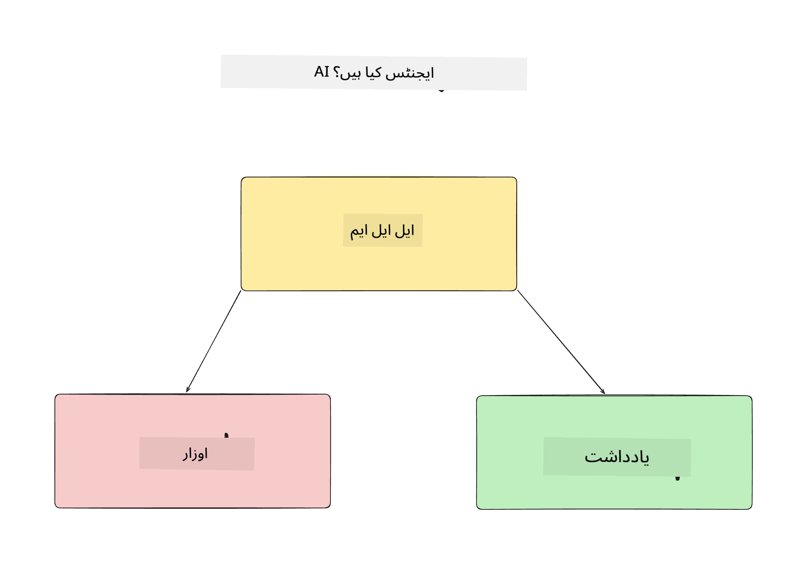
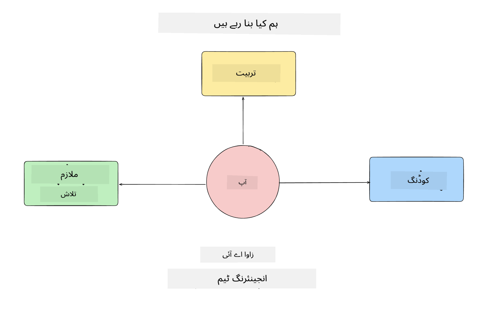
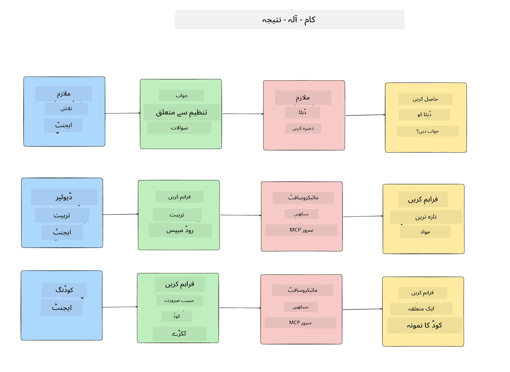
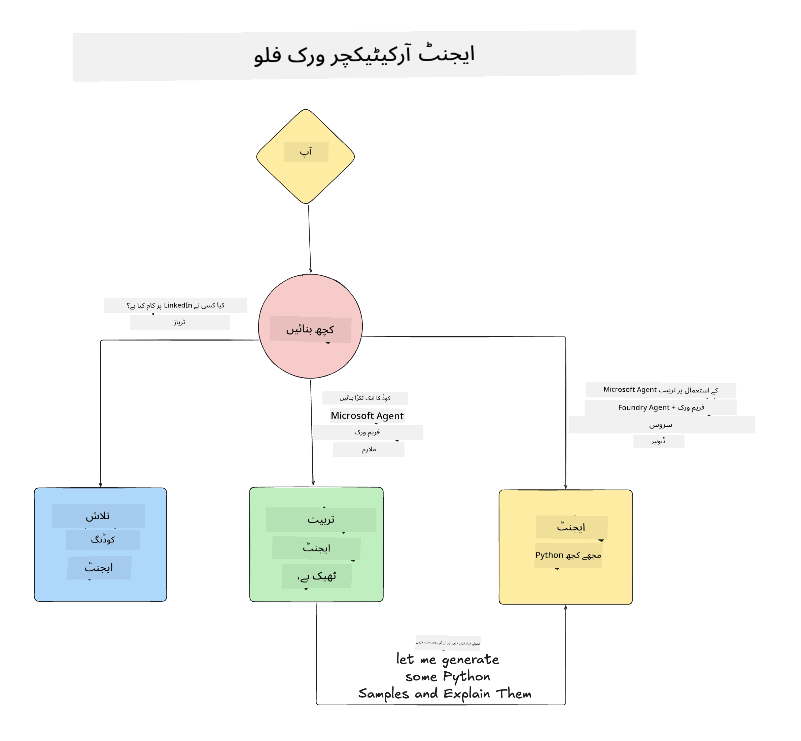

<!--
CO_OP_TRANSLATOR_METADATA:
{
  "original_hash": "99c07849641a850775c188c9333f31e5",
  "translation_date": "2025-12-12T18:17:26+00:00",
  "source_file": "lesson-1-agent-design/README.md",
  "language_code": "ur"
}
-->
# سبق 1: AI ایجنٹ ڈیزائن

"زیرو سے پروڈکشن تک AI ایجنٹ بنانے کے کورس" کے پہلے سبق میں خوش آمدید!

اس سبق میں ہم درج ذیل موضوعات کا احاطہ کریں گے:

- AI ایجنٹس کیا ہیں کی تعریف
  
- ہم جو AI ایجنٹ ایپلیکیشن بنا رہے ہیں اس پر بات کریں گے  

- ہر ایجنٹ کے لیے درکار ٹولز اور سروسز کی شناخت کریں گے
  
- اپنے ایجنٹ ایپلیکیشن کا آرکیٹیکچر بنائیں گے
  
آئیے شروع کرتے ہیں کہ ایجنٹ کیا ہیں اور ہم انہیں ایپلیکیشن کے اندر کیوں استعمال کریں گے۔

## AI ایجنٹس کیا ہیں؟

اگر یہ آپ کا پہلا موقع ہے کہ آپ AI ایجنٹ بنانے کا طریقہ تلاش کر رہے ہیں، تو آپ کے ذہن میں یہ سوالات ہو سکتے ہیں کہ AI ایجنٹ کو بالکل کیسے تعریف کیا جائے۔

ایک آسان طریقہ یہ ہے کہ AI ایجنٹ کو ان اجزاء کی بنیاد پر تعریف کریں جو اسے بناتے ہیں:

**بڑا زبان ماڈل** - LLM صارف کی طرف سے قدرتی زبان کو پروسیس کرنے کی صلاحیت فراہم کرے گا تاکہ وہ کام کی تشریح کر سکے جو صارف مکمل کرنا چاہتا ہے اور ساتھ ہی دستیاب ٹولز کی وضاحت کو بھی سمجھ سکے تاکہ وہ کام مکمل ہو سکیں۔

**ٹولز** - یہ فنکشنز، APIs، ڈیٹا اسٹورز اور دیگر سروسز ہوں گی جنہیں LLM منتخب کر کے صارف کی درخواست کردہ کاموں کو مکمل کرنے کے لیے استعمال کر سکتا ہے۔

**میموری** - یہ وہ طریقہ ہے جس سے ہم AI ایجنٹ اور صارف کے درمیان قلیل مدتی اور طویل مدتی تعاملات کو ذخیرہ کرتے ہیں۔ اس معلومات کو ذخیرہ کرنا اور بازیافت کرنا بہت اہم ہے تاکہ وقت کے ساتھ بہتری لائی جا سکے اور صارف کی ترجیحات محفوظ کی جا سکیں۔

## ہمارا AI ایجنٹ استعمال کا کیس

اس کورس کے لیے، ہم ایک AI ایجنٹ ایپلیکیشن بنائیں گے جو نئے ڈویلپرز کو ہمارے AI ایجنٹ ڈیولپمنٹ ٹیم میں شامل ہونے میں مدد دے گی!

کسی بھی ترقیاتی کام سے پہلے، ایک کامیاب AI ایجنٹ ایپلیکیشن بنانے کا پہلا قدم یہ ہے کہ ہم واضح منظرنامے متعین کریں کہ ہم اپنے صارفین سے توقع کرتے ہیں کہ وہ ہمارے AI ایجنٹس کے ساتھ کیسے کام کریں گے۔

اس ایپلیکیشن کے لیے، ہم ان منظرناموں پر کام کریں گے:

**منظرنامہ 1**: ایک نیا ملازم ہماری تنظیم میں شامل ہوتا ہے اور وہ ٹیم کے بارے میں مزید جاننا چاہتا ہے جس میں وہ شامل ہوا ہے اور ان سے کیسے رابطہ کرے۔

**منظرنامہ 2:** ایک نیا ملازم جاننا چاہتا ہے کہ ان کے لیے بہترین پہلا کام کیا ہوگا جس پر وہ کام شروع کر سکیں۔

**منظرنامہ 3:** ایک نیا ملازم سیکھنے کے وسائل اور کوڈ نمونے جمع کرنا چاہتا ہے تاکہ وہ اس کام کو مکمل کرنے میں مدد حاصل کر سکے۔

## ٹولز اور سروسز کی شناخت

اب جب کہ ہمارے پاس یہ منظرنامے تیار ہیں، اگلا قدم یہ ہے کہ ہم انہیں ان ٹولز اور سروسز سے منسلک کریں جن کی ہمارے AI ایجنٹس کو ان کاموں کو مکمل کرنے کے لیے ضرورت ہوگی۔

یہ عمل کانٹیکسٹ انجینئرنگ کے زمرے میں آتا ہے کیونکہ ہم اس بات پر توجہ مرکوز کریں گے کہ ہمارے AI ایجنٹس کے پاس صحیح وقت پر صحیح کانٹیکسٹ موجود ہو تاکہ وہ کام مکمل کر سکیں۔

آئیے ہر منظرنامے کو الگ الگ کریں اور اچھے ایجنٹ ڈیزائن کے لیے ہر ایجنٹ کے کام، ٹولز اور مطلوبہ نتائج کی فہرست بنائیں۔

### منظرنامہ 1 - ملازم تلاش ایجنٹ

**کام** - تنظیم میں ملازمین کے بارے میں سوالات کے جواب دینا جیسے شمولیت کی تاریخ، موجودہ ٹیم، مقام اور آخری عہدہ۔

**ٹولز** - موجودہ ملازمین کی فہرست اور تنظیمی چارٹ کا ڈیٹا اسٹور

**نتائج** - ڈیٹا اسٹور سے معلومات حاصل کر کے عمومی تنظیمی سوالات اور ملازمین کے مخصوص سوالات کے جواب دینے کے قابل ہونا۔

### منظرنامہ 2 - کام کی سفارش ایجنٹ

**کام** - نئے ملازم کے ڈویلپر تجربے کی بنیاد پر 1-3 مسائل تجویز کرنا جن پر وہ کام کر سکتا ہے۔

**ٹولز** - GitHub MCP سرور تاکہ کھلے مسائل حاصل کیے جا سکیں اور ڈویلپر پروفائل بنایا جا سکے۔

**نتائج** - GitHub پروفائل کی آخری 5 کمیٹس اور GitHub پروجیکٹ کے کھلے مسائل پڑھ کر میچ کی بنیاد پر سفارشات دینا۔

### منظرنامہ 3 - کوڈ اسسٹنٹ ایجنٹ

**کام** - "کام کی سفارش" ایجنٹ کی جانب سے تجویز کردہ کھلے مسائل کی بنیاد پر تحقیق کرنا، وسائل فراہم کرنا اور ملازم کی مدد کے لیے کوڈ کے نمونے تیار کرنا۔

**ٹولز** - Microsoft Learn MCP وسائل تلاش کرنے کے لیے اور Code Interpreter کسٹم کوڈ نمونے تیار کرنے کے لیے۔

**نتائج** - اگر صارف اضافی مدد مانگے تو ورک فلو Learn MCP سرور کا استعمال کرتے ہوئے وسائل کے لنکس اور نمونے فراہم کرے گا اور پھر Code Interpreter ایجنٹ کو ہینڈ آف کرے گا تاکہ وضاحتوں کے ساتھ چھوٹے کوڈ نمونے تیار کیے جا سکیں۔

## اپنے ایجنٹ ایپلیکیشن کا آرکیٹیکچر بنانا

اب جب کہ ہم نے اپنے ہر ایجنٹ کی تعریف کر لی ہے، آئیے ایک آرکیٹیکچر ڈایاگرام بنائیں جو ہمیں سمجھنے میں مدد دے کہ ہر ایجنٹ کس طرح ایک ساتھ اور الگ الگ کام کرے گا، کام کی نوعیت کے مطابق:

## اگلے اقدامات

اب جب کہ ہم نے ہر ایجنٹ اور ہمارے ایجنٹک سسٹم کا ڈیزائن کر لیا ہے، آئیے اگلے سبق کی طرف بڑھیں جہاں ہم ان میں سے ہر ایک ایجنٹ کو تیار کریں گے!

---

<!-- CO-OP TRANSLATOR DISCLAIMER START -->
**دستخطی دستبرداری**:  
یہ دستاویز AI ترجمہ سروس [Co-op Translator](https://github.com/Azure/co-op-translator) کے ذریعے ترجمہ کی گئی ہے۔ اگرچہ ہم درستگی کے لیے کوشاں ہیں، براہ کرم اس بات سے آگاہ رہیں کہ خودکار ترجمے میں غلطیاں یا عدم درستیاں ہو سکتی ہیں۔ اصل دستاویز اپنی مادری زبان میں ہی معتبر ماخذ سمجھی جانی چاہیے۔ اہم معلومات کے لیے پیشہ ور انسانی ترجمہ کی سفارش کی جاتی ہے۔ اس ترجمے کے استعمال سے پیدا ہونے والی کسی بھی غلط فہمی یا غلط تشریح کی ذمہ داری ہم پر عائد نہیں ہوتی۔
<!-- CO-OP TRANSLATOR DISCLAIMER END -->