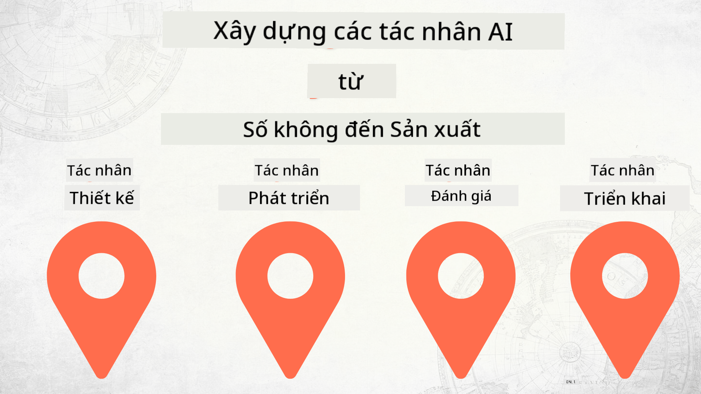

<!--
CO_OP_TRANSLATOR_METADATA:
{
  "original_hash": "d8cf941adeb146a5f00f04e4726c3033",
  "translation_date": "2025-12-19T10:26:31+00:00",
  "source_file": "README.md",
  "language_code": "vi"
}
-->
# Xây dựng Đại lý AI từ Con số đến Sản xuất

### 🌐 Hỗ trợ Đa ngôn ngữ

#### Hỗ trợ qua GitHub Action (Tự động & Luôn Cập nhật)

<!-- CO-OP TRANSLATOR LANGUAGES TABLE START -->
[Tiếng Ả Rập](../ar/README.md) | [Tiếng Bengal](../bn/README.md) | [Tiếng Bulgaria](../bg/README.md) | [Tiếng Miến Điện (Myanmar)](../my/README.md) | [Tiếng Trung (Giản thể)](../zh/README.md) | [Tiếng Trung (Phồn thể, Hồng Kông)](../hk/README.md) | [Tiếng Trung (Phồn thể, Macau)](../mo/README.md) | [Tiếng Trung (Phồn thể, Đài Loan)](../tw/README.md) | [Tiếng Croatia](../hr/README.md) | [Tiếng Séc](../cs/README.md) | [Tiếng Đan Mạch](../da/README.md) | [Tiếng Hà Lan](../nl/README.md) | [Tiếng Estonia](../et/README.md) | [Tiếng Phần Lan](../fi/README.md) | [Tiếng Pháp](../fr/README.md) | [Tiếng Đức](../de/README.md) | [Tiếng Hy Lạp](../el/README.md) | [Tiếng Do Thái](../he/README.md) | [Tiếng Hindi](../hi/README.md) | [Tiếng Hungary](../hu/README.md) | [Tiếng Indonesia](../id/README.md) | [Tiếng Ý](../it/README.md) | [Tiếng Nhật](../ja/README.md) | [Tiếng Kannada](../kn/README.md) | [Tiếng Hàn](../ko/README.md) | [Tiếng Litva](../lt/README.md) | [Tiếng Mã Lai](../ms/README.md) | [Tiếng Malayalam](../ml/README.md) | [Tiếng Marathi](../mr/README.md) | [Tiếng Nepal](../ne/README.md) | [Tiếng Pidgin Nigeria](../pcm/README.md) | [Tiếng Na Uy](../no/README.md) | [Tiếng Ba Tư (Farsi)](../fa/README.md) | [Tiếng Ba Lan](../pl/README.md) | [Tiếng Bồ Đào Nha (Brazil)](../br/README.md) | [Tiếng Bồ Đào Nha (Bồ Đào Nha)](../pt/README.md) | [Tiếng Punjabi (Gurmukhi)](../pa/README.md) | [Tiếng Romania](../ro/README.md) | [Tiếng Nga](../ru/README.md) | [Tiếng Serbia (Chữ Kirin)](../sr/README.md) | [Tiếng Slovakia](../sk/README.md) | [Tiếng Slovenia](../sl/README.md) | [Tiếng Tây Ban Nha](../es/README.md) | [Tiếng Swahili](../sw/README.md) | [Tiếng Thụy Điển](../sv/README.md) | [Tiếng Tagalog (Philippines)](../tl/README.md) | [Tiếng Tamil](../ta/README.md) | [Tiếng Telugu](../te/README.md) | [Tiếng Thái](../th/README.md) | [Tiếng Thổ Nhĩ Kỳ](../tr/README.md) | [Tiếng Ukraina](../uk/README.md) | [Tiếng Urdu](../ur/README.md) | [Tiếng Việt](./README.md)
<!-- CO-OP TRANSLATOR LANGUAGES TABLE END -->

## Một khóa học dạy bạn những kiến thức cơ bản về Vòng đời Phát triển Đại lý AI

## 🌱 Bắt đầu

Khóa học này có các bài học bao gồm những kiến thức cơ bản về xây dựng và triển khai Đại lý AI.

Mỗi bài học xây dựng dựa trên bài học trước đó, vì vậy chúng tôi khuyên bạn nên bắt đầu từ đầu và làm theo đến cuối.

Nếu bạn muốn khám phá thêm về các chủ đề Đại lý AI, bạn có thể xem khóa [Khóa học Đại lý AI cho Người mới bắt đầu](https://aka.ms/ai-agents-beginners).

### Gặp gỡ các học viên khác, Nhận câu trả lời cho câu hỏi của bạn

Nếu bạn gặp khó khăn hoặc có bất kỳ câu hỏi nào về xây dựng Đại lý AI, hãy tham gia Kênh Discord chuyên dụng của chúng tôi trong [Microsoft Foundry Discord](https://discord.gg/Kuaw3ktsu6).

### Những gì bạn cần

Mỗi bài học có mẫu mã nguồn riêng mà bạn có thể chạy cục bộ. Bạn có thể [fork repo này](https://github.com/microsoft/Building-AI-Agents-From-Zero-To-Production/fork) để tạo bản sao của riêng bạn.

Khóa học hiện tại sử dụng các công cụ sau:

- [Microsoft Agent Framework (MAF)](https://aka.ms/ai-agents-beginners/agent-framework)
- [Microsoft Foundry](https://azure.microsoft.com/products/ai-foundry)
- [Dịch vụ Azure OpenAI](https://azure.microsoft.com/products/ai-foundry/models/openai)
- [Azure CLI](https://learn.microsoft.com/cli/azure/authenticate-azure-cli?view=azure-cli-latest)

Vui lòng đảm bảo bạn có quyền truy cập vào các dịch vụ này trước khi bắt đầu.

Sẽ có thêm nhiều lựa chọn về lưu trữ mô hình và dịch vụ sắp tới.

## 🗃️ Các bài học

| **Bài học**         | **Mô tả**                                                                                  |
|--------------------|--------------------------------------------------------------------------------------------------|
| [Thiết kế Đại lý](./lesson-1-agent-design/README.md)       | Giới thiệu về trường hợp sử dụng "Hướng dẫn Nhà phát triển" của Đại lý và cách thiết kế đại lý hiệu quả  |
| [Phát triển Đại lý](./lesson-2-agent-development/README.md)  | Sử dụng Microsoft Agent Framework (MAF), tạo 3 đại lý để giúp nhà phát triển mới làm quen.       |
| [Đánh giá Đại lý](./lesson-3-agent-evals/README.md)  | Sử dụng Microsoft Foundry, tìm hiểu hiệu suất hoạt động của Đại lý AI và cách cải thiện chúng. |
| [Triển khai Đại lý](./lesson-4-agent-deployment/README.md)   | Sử dụng Đại lý được lưu trữ và OpenAI Chatkit, xem cách triển khai Đại lý AI vào sản xuất.       |

## 🎒 Các khóa học khác

Nhóm của chúng tôi còn sản xuất các khóa học khác! Hãy xem:

<!-- CO-OP TRANSLATOR OTHER COURSES START -->
### LangChain

---

### Azure / Edge / MCP / Đại lý

---
 
### Chuỗi AI Tạo sinh

[-9333EA?style=for-the-badge&labelColor=E5E7EB&color=9333EA)](https://github.com/microsoft/Generative-AI-for-beginners-dotnet?WT.mc_id=academic-105485-koreyst)
[-C084FC?style=for-the-badge&labelColor=E5E7EB&color=C084FC)](https://github.com/microsoft/generative-ai-for-beginners-java?WT.mc_id=academic-105485-koreyst)
[-E879F9?style=for-the-badge&labelColor=E5E7EB&color=E879F9)](https://github.com/microsoft/generative-ai-with-javascript?WT.mc_id=academic-105485-koreyst)

---
 
### Học tập Cốt lõi

---
 
### Series Copilot

<!-- CO-OP TRANSLATOR OTHER COURSES END -->

## Đóng góp

Dự án này hoan nghênh các đóng góp và đề xuất. Hầu hết các đóng góp yêu cầu bạn đồng ý với
Thỏa thuận Giấy phép Đóng góp (CLA) tuyên bố rằng bạn có quyền, và thực sự cấp cho chúng tôi
quyền sử dụng đóng góp của bạn. Để biết chi tiết, hãy truy cập <https://cla.opensource.microsoft.com>.

Khi bạn gửi yêu cầu kéo, một bot CLA sẽ tự động xác định xem bạn có cần cung cấp
CLA và trang trí PR phù hợp (ví dụ: kiểm tra trạng thái, bình luận). Chỉ cần làm theo hướng dẫn
do bot cung cấp. Bạn chỉ cần làm điều này một lần cho tất cả các kho sử dụng CLA của chúng tôi.

Dự án này đã áp dụng [Bộ Quy tắc Ứng xử Mã nguồn Mở của Microsoft](https://opensource.microsoft.com/codeofconduct/).
Để biết thêm thông tin, xem [Câu hỏi thường gặp về Quy tắc Ứng xử](https://opensource.microsoft.com/codeofconduct/faq/) hoặc
liên hệ [opencode@microsoft.com](mailto:opencode@microsoft.com) với bất kỳ câu hỏi hoặc nhận xét bổ sung nào.

## Nhãn hiệu

Dự án này có thể chứa nhãn hiệu hoặc logo cho các dự án, sản phẩm hoặc dịch vụ. Việc sử dụng nhãn hiệu hoặc logo Microsoft được ủy quyền phải tuân theo và phải theo
[Hướng dẫn Nhãn hiệu & Thương hiệu của Microsoft](https://www.microsoft.com/legal/intellectualproperty/trademarks/usage/general).
Việc sử dụng nhãn hiệu hoặc logo Microsoft trong các phiên bản sửa đổi của dự án này không được gây nhầm lẫn hoặc ngụ ý sự tài trợ của Microsoft.
Bất kỳ việc sử dụng nhãn hiệu hoặc logo của bên thứ ba nào đều phải tuân theo chính sách của các bên thứ ba đó.

## Nhận trợ giúp

Nếu bạn gặp khó khăn hoặc có bất kỳ câu hỏi nào về việc xây dựng ứng dụng AI, hãy tham gia:

Nếu bạn có phản hồi về sản phẩm hoặc lỗi trong quá trình xây dựng, hãy truy cập:

---

<!-- CO-OP TRANSLATOR DISCLAIMER START -->
**Tuyên bố từ chối trách nhiệm**:  
Tài liệu này đã được dịch bằng dịch vụ dịch thuật AI [Co-op Translator](https://github.com/Azure/co-op-translator). Mặc dù chúng tôi cố gắng đảm bảo độ chính xác, xin lưu ý rằng bản dịch tự động có thể chứa lỗi hoặc không chính xác. Tài liệu gốc bằng ngôn ngữ gốc của nó nên được coi là nguồn chính xác và đáng tin cậy. Đối với các thông tin quan trọng, nên sử dụng dịch vụ dịch thuật chuyên nghiệp do con người thực hiện. Chúng tôi không chịu trách nhiệm về bất kỳ sự hiểu lầm hoặc giải thích sai nào phát sinh từ việc sử dụng bản dịch này.
<!-- CO-OP TRANSLATOR DISCLAIMER END -->