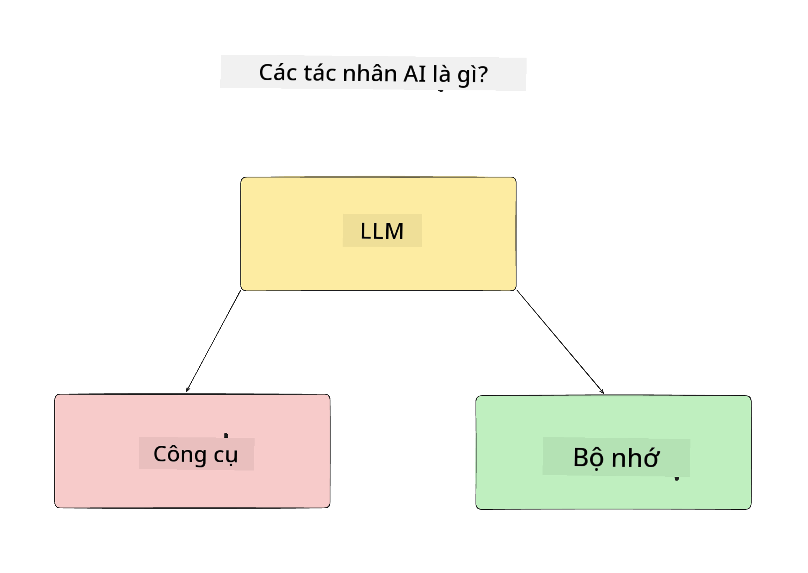
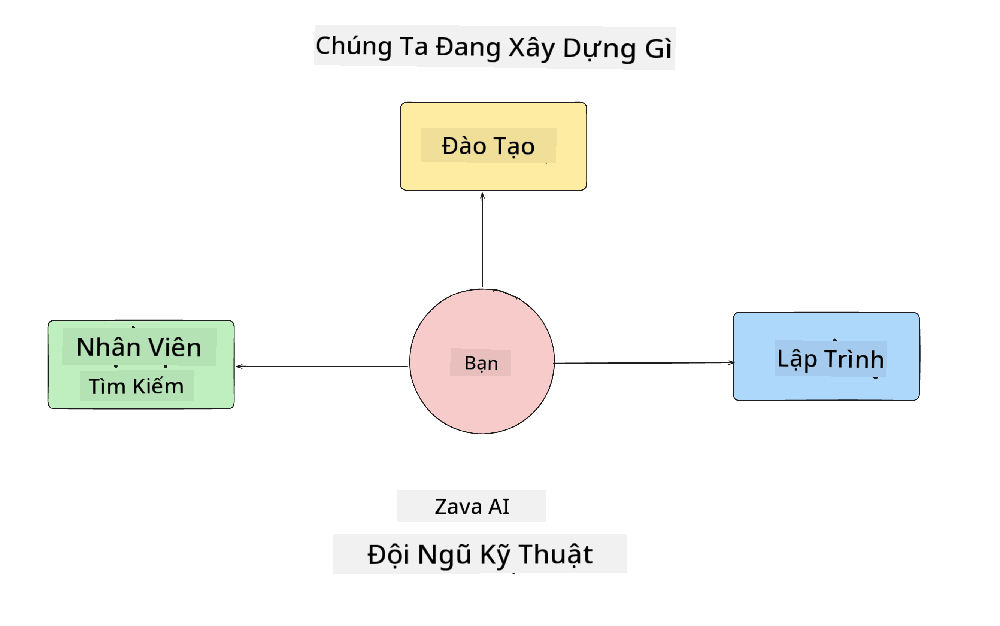
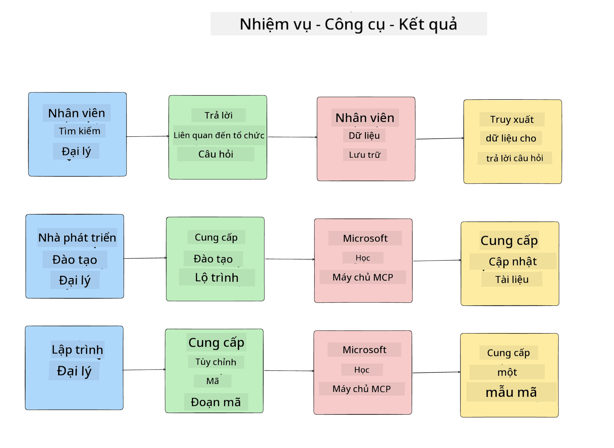

<!--
CO_OP_TRANSLATOR_METADATA:
{
  "original_hash": "99c07849641a850775c188c9333f31e5",
  "translation_date": "2025-12-12T18:34:12+00:00",
  "source_file": "lesson-1-agent-design/README.md",
  "language_code": "vi"
}
-->
# Bài học 1: Thiết kế Đại lý AI

Chào mừng bạn đến với bài học đầu tiên của khóa học "Xây dựng Đại lý AI từ con số 0 đến sản xuất"!

Trong bài học này, chúng ta sẽ đề cập đến:

- Định nghĩa Đại lý AI là gì
  
- Thảo luận về Ứng dụng Đại lý AI mà chúng ta đang xây dựng  

- Xác định các công cụ và dịch vụ cần thiết cho từng đại lý
  
- Kiến trúc Ứng dụng Đại lý của chúng ta
  
Hãy bắt đầu bằng cách định nghĩa đại lý là gì và tại sao chúng ta lại sử dụng chúng trong một ứng dụng.

## Đại lý AI là gì?

Nếu đây là lần đầu tiên bạn khám phá cách xây dựng một Đại lý AI, bạn có thể có những câu hỏi về cách định nghĩa chính xác Đại lý AI là gì.

Một cách đơn giản để định nghĩa Đại lý AI là dựa trên các thành phần tạo nên nó:

**Mô hình Ngôn ngữ Lớn** - LLM sẽ cung cấp khả năng xử lý ngôn ngữ tự nhiên từ người dùng để hiểu nhiệm vụ họ muốn hoàn thành cũng như diễn giải các mô tả về các công cụ có sẵn để hoàn thành các nhiệm vụ đó.

**Công cụ** - Đây sẽ là các hàm, API, kho dữ liệu và các dịch vụ khác mà LLM có thể chọn sử dụng để hoàn thành các nhiệm vụ do người dùng yêu cầu.

**Bộ nhớ** - Đây là cách chúng ta lưu trữ cả tương tác ngắn hạn và dài hạn giữa Đại lý AI và người dùng. Việc lưu trữ và truy xuất thông tin này rất quan trọng để cải thiện và lưu giữ sở thích của người dùng theo thời gian.

## Trường hợp sử dụng Đại lý AI của chúng ta

Trong khóa học này, chúng ta sẽ xây dựng một ứng dụng Đại lý AI giúp các nhà phát triển mới gia nhập Đội phát triển Đại lý AI của chúng ta!

Trước khi bắt đầu phát triển, bước đầu tiên để tạo ra một ứng dụng Đại lý AI thành công là xác định rõ các kịch bản mà chúng ta mong đợi người dùng sẽ làm việc với các Đại lý AI của mình.

Đối với ứng dụng này, chúng ta sẽ làm việc với các kịch bản sau:

**Kịch bản 1**: Một nhân viên mới gia nhập tổ chức và muốn biết thêm về đội nhóm họ tham gia và cách kết nối với họ.

**Kịch bản 2:** Một nhân viên mới muốn biết nhiệm vụ đầu tiên tốt nhất để họ bắt đầu làm việc là gì.

**Kịch bản 3:** Một nhân viên mới muốn thu thập tài nguyên học tập và mẫu mã nguồn để giúp họ bắt đầu hoàn thành nhiệm vụ này.

## Xác định Công cụ và Dịch vụ

Bây giờ chúng ta đã có các kịch bản này, bước tiếp theo là ánh xạ chúng với các công cụ và dịch vụ mà các đại lý AI của chúng ta sẽ cần để hoàn thành các nhiệm vụ này.

Quá trình này thuộc lĩnh vực Kỹ thuật Ngữ cảnh vì chúng ta sẽ tập trung đảm bảo rằng các Đại lý AI của mình có ngữ cảnh phù hợp vào đúng thời điểm để hoàn thành nhiệm vụ.

Hãy làm điều này từng kịch bản một và thực hiện thiết kế đại lý tốt bằng cách liệt kê nhiệm vụ, công cụ và kết quả mong muốn của từng đại lý.

### Kịch bản 1 - Đại lý Tìm kiếm Nhân viên

**Nhiệm vụ** - Trả lời các câu hỏi về nhân viên trong tổ chức như ngày gia nhập, đội hiện tại, vị trí và vị trí công việc cuối cùng.

**Công cụ** - Kho dữ liệu danh sách nhân viên hiện tại và sơ đồ tổ chức

**Kết quả** - Có thể truy xuất thông tin từ kho dữ liệu để trả lời các câu hỏi chung về tổ chức và các câu hỏi cụ thể về nhân viên.

### Kịch bản 2 - Đại lý Đề xuất Nhiệm vụ

**Nhiệm vụ** - Dựa trên kinh nghiệm phát triển của nhân viên mới, đưa ra 1-3 vấn đề mà nhân viên mới có thể làm việc.

**Công cụ** - Máy chủ MCP GitHub để lấy các vấn đề mở và xây dựng hồ sơ nhà phát triển

**Kết quả** - Có thể đọc 5 lần cam kết cuối cùng của Hồ sơ GitHub và các vấn đề mở trên dự án GitHub và đưa ra đề xuất dựa trên sự phù hợp

### Kịch bản 3 - Đại lý Trợ lý Mã nguồn

**Nhiệm vụ** - Dựa trên các Vấn đề Mở được Đại lý "Đề xuất Nhiệm vụ" khuyến nghị, nghiên cứu và cung cấp tài nguyên cũng như tạo đoạn mã để giúp nhân viên.

**Công cụ** - Microsoft Learn MCP để tìm tài nguyên và Bộ giải mã Mã để tạo đoạn mã tùy chỉnh.

**Kết quả** - Nếu người dùng yêu cầu trợ giúp thêm, quy trình làm việc sẽ sử dụng Máy chủ Learn MCP để cung cấp liên kết và đoạn mã đến tài nguyên rồi chuyển giao cho đại lý Bộ giải mã Mã để tạo các đoạn mã nhỏ kèm giải thích.

## Kiến trúc Ứng dụng Đại lý của chúng ta

Bây giờ chúng ta đã định nghĩa từng Đại lý, hãy tạo một sơ đồ kiến trúc giúp chúng ta hiểu cách mỗi đại lý sẽ làm việc cùng nhau và riêng biệt tùy theo nhiệm vụ:

## Bước tiếp theo

Bây giờ chúng ta đã thiết kế từng đại lý và hệ thống đại lý của mình, hãy chuyển sang bài học tiếp theo nơi chúng ta sẽ phát triển từng đại lý này!

---

<!-- CO-OP TRANSLATOR DISCLAIMER START -->
**Tuyên bố từ chối trách nhiệm**:  
Tài liệu này đã được dịch bằng dịch vụ dịch thuật AI [Co-op Translator](https://github.com/Azure/co-op-translator). Mặc dù chúng tôi cố gắng đảm bảo độ chính xác, xin lưu ý rằng các bản dịch tự động có thể chứa lỗi hoặc không chính xác. Tài liệu gốc bằng ngôn ngữ gốc của nó nên được coi là nguồn tham khảo chính thức. Đối với các thông tin quan trọng, nên sử dụng dịch vụ dịch thuật chuyên nghiệp do con người thực hiện. Chúng tôi không chịu trách nhiệm về bất kỳ sự hiểu lầm hoặc giải thích sai nào phát sinh từ việc sử dụng bản dịch này.
<!-- CO-OP TRANSLATOR DISCLAIMER END -->