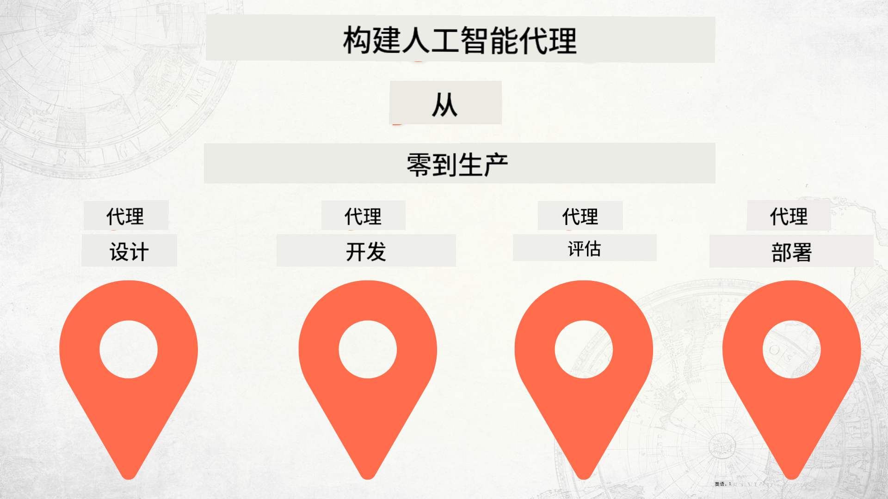

<!--
CO_OP_TRANSLATOR_METADATA:
{
  "original_hash": "f8ea8224e106540413202b4151bb2bcd",
  "translation_date": "2025-12-15T14:11:40+00:00",
  "source_file": "README.md",
  "language_code": "zh"
}
-->
# 从零到生产构建 AI 代理

### 🌐 多语言支持

#### 通过 GitHub Action 支持（自动且始终保持最新）

<!-- CO-OP TRANSLATOR LANGUAGES TABLE START -->
[阿拉伯语](../ar/README.md) | [孟加拉语](../bn/README.md) | [保加利亚语](../bg/README.md) | [缅甸语 (Myanmar)](../my/README.md) | [中文（简体）](./README.md) | [中文（繁体，香港）](../hk/README.md) | [中文（繁体，澳门）](../mo/README.md) | [中文（繁体，台湾）](../tw/README.md) | [克罗地亚语](../hr/README.md) | [捷克语](../cs/README.md) | [丹麦语](../da/README.md) | [荷兰语](../nl/README.md) | [爱沙尼亚语](../et/README.md) | [芬兰语](../fi/README.md) | [法语](../fr/README.md) | [德语](../de/README.md) | [希腊语](../el/README.md) | [希伯来语](../he/README.md) | [印地语](../hi/README.md) | [匈牙利语](../hu/README.md) | [印度尼西亚语](../id/README.md) | [意大利语](../it/README.md) | [日语](../ja/README.md) | [卡纳达语](../kn/README.md) | [韩语](../ko/README.md) | [立陶宛语](../lt/README.md) | [马来语](../ms/README.md) | [马拉雅拉姆语](../ml/README.md) | [马拉地语](../mr/README.md) | [尼泊尔语](../ne/README.md) | [尼日利亚皮钦语](../pcm/README.md) | [挪威语](../no/README.md) | [波斯语 (法尔西语)](../fa/README.md) | [波兰语](../pl/README.md) | [葡萄牙语（巴西）](../br/README.md) | [葡萄牙语（葡萄牙）](../pt/README.md) | [旁遮普语（古鲁姆基）](../pa/README.md) | [罗马尼亚语](../ro/README.md) | [俄语](../ru/README.md) | [塞尔维亚语（西里尔字母）](../sr/README.md) | [斯洛伐克语](../sk/README.md) | [斯洛文尼亚语](../sl/README.md) | [西班牙语](../es/README.md) | [斯瓦希里语](../sw/README.md) | [瑞典语](../sv/README.md) | [他加禄语（菲律宾语）](../tl/README.md) | [泰米尔语](../ta/README.md) | [泰卢固语](../te/README.md) | [泰语](../th/README.md) | [土耳其语](../tr/README.md) | [乌克兰语](../uk/README.md) | [乌尔都语](../ur/README.md) | [越南语](../vi/README.md)
<!-- CO-OP TRANSLATOR LANGUAGES TABLE END -->

## 教你 AI 代理开发生命周期基础的课程

## 🌱 入门指南

本课程涵盖构建和部署 AI 代理的基础知识。

每节课都建立在前一节课的基础上，因此建议从头开始，逐步学习直到完成。

如果你想深入了解更多 AI 代理相关主题，可以查看 [AI 代理初学者课程](https://aka.ms/ai-agents-beginners)。

### 结识其他学习者，获得问题解答

如果你遇到困难或对构建 AI 代理有任何疑问，欢迎加入我们在 [Microsoft Foundry Discord](https://discord.gg/Kuaw3ktsu6) 的专属 Discord 频道。

### 你需要准备的内容

每节课都有自己的代码示例，你可以在本地运行。你可以[分叉此仓库](https://github.com/microsoft/Building-AI-Agents-From-Zero-To-Production/fork)来创建自己的副本。

本课程当前使用以下内容：

- [Microsoft Agent Framework (MAF)](https://aka.ms/ai-agents-beginners/agent-framework)
- [Microsoft Foundry](https://azure.microsoft.com/products/ai-foundry)
- [Azure OpenAI 服务](https://azure.microsoft.com/products/ai-foundry/models/openai)
- [Azure CLI](https://learn.microsoft.com/cli/azure/authenticate-azure-cli?view=azure-cli-latest)

请确保在开始之前你已能访问这些服务。

更多关于模型托管和服务的选项即将推出。

## 🗃️ 课程列表

| **课程**         | **描述**                                                                                  |
|--------------------|--------------------------------------------------------------------------------------------------|
| [代理设计](./lesson-1-agent-design/README.md)       | 介绍我们的“开发者入门”代理用例以及如何设计高效代理  |
| [代理开发](./lesson-2-agent-development/README.md)  | 使用 Microsoft Agent Framework (MAF)，创建 3 个帮助新开发者入门的代理。       |
| [代理评估](./lesson-3-agent-evals/README.md)  | 使用 Microsoft Foundry，了解我们的 AI 代理表现如何以及如何改进它们。 |
| [代理部署](./lesson-4-agent-deployment/README.md)   | 使用托管代理和 OpenAI Chatkit，了解如何将 AI 代理部署到生产环境。       |

## 贡献

欢迎对本项目进行贡献和提出建议。大多数贡献需要你同意一份贡献者许可协议（CLA），声明你有权利且确实授予我们使用你贡献的权利。详情请访问 <https://cla.opensource.microsoft.com>。

当你提交拉取请求时，CLA 机器人会自动判断你是否需要提供 CLA 并相应地标注 PR（例如状态检查、评论）。只需按照机器人提供的指示操作。你只需在所有使用我们 CLA 的仓库中执行一次此操作。

本项目已采用 [Microsoft 开源行为准则](https://opensource.microsoft.com/codeofconduct/)。
更多信息请参见 [行为准则常见问题](https://opensource.microsoft.com/codeofconduct/faq/) 或通过邮件联系 [opencode@microsoft.com](mailto:opencode@microsoft.com) 以获取更多问题或建议。

## 商标

本项目可能包含项目、产品或服务的商标或标识。微软商标或标识的授权使用须遵守并遵循
[微软商标和品牌指南](https://www.microsoft.com/legal/intellectualproperty/trademarks/usage/general)。
在本项目的修改版本中使用微软商标或标识不得引起混淆或暗示微软赞助。
任何第三方商标或标识的使用均须遵守相应第三方的政策。

## 获取帮助

如果你遇到困难或对构建 AI 应用有任何疑问，欢迎加入：

如果你在构建过程中有产品反馈或遇到错误，请访问：

---

<!-- CO-OP TRANSLATOR DISCLAIMER START -->
**免责声明**：  
本文件由人工智能翻译服务 [Co-op Translator](https://github.com/Azure/co-op-translator) 翻译而成。尽管我们力求准确，但请注意自动翻译可能存在错误或不准确之处。原始文件的母语版本应被视为权威来源。对于重要信息，建议使用专业人工翻译。因使用本翻译而产生的任何误解或误释，我们概不负责。
<!-- CO-OP TRANSLATOR DISCLAIMER END -->