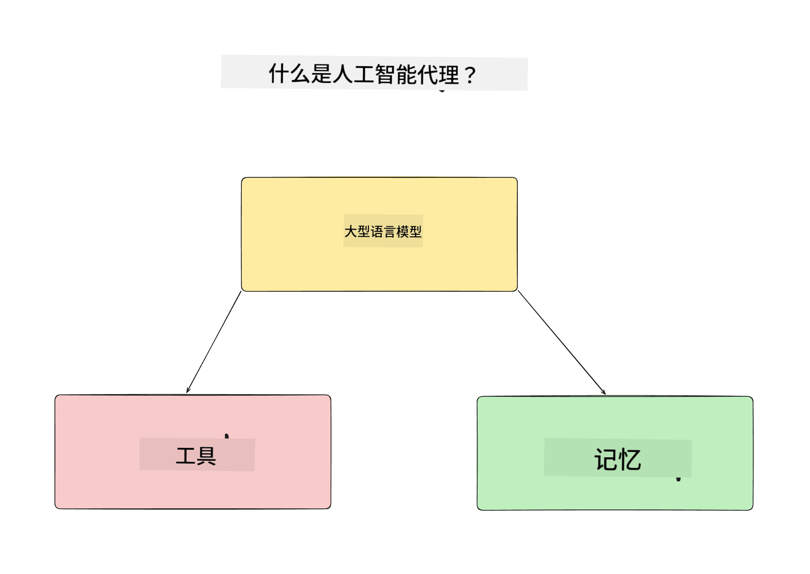
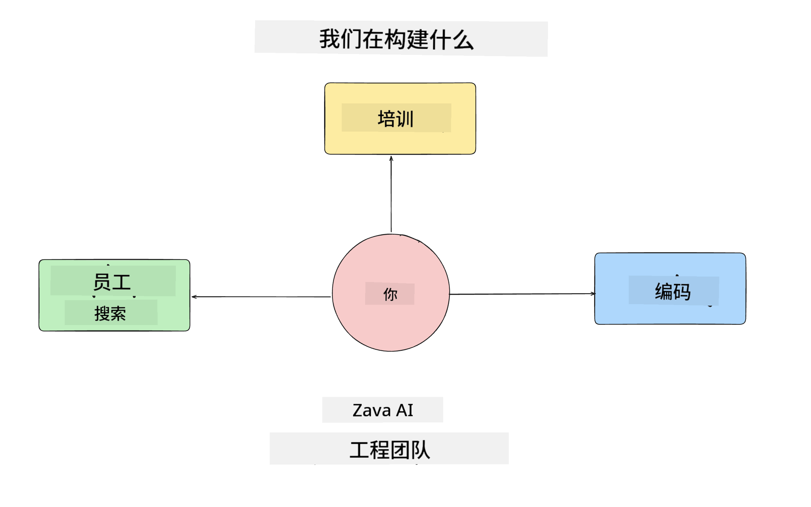
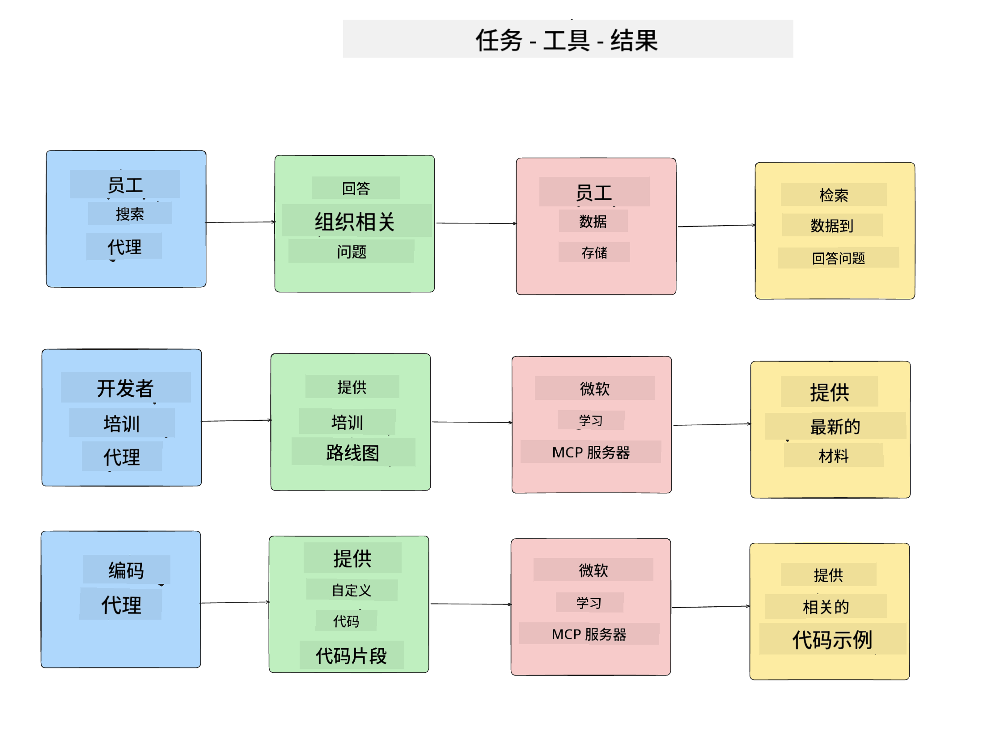
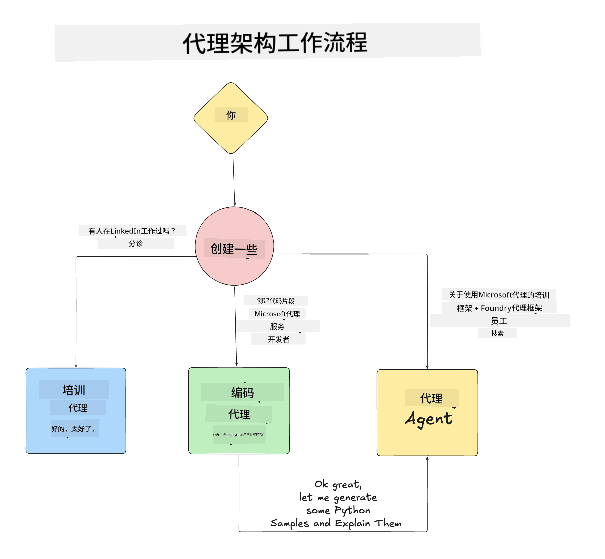

<!--
CO_OP_TRANSLATOR_METADATA:
{
  "original_hash": "99c07849641a850775c188c9333f31e5",
  "translation_date": "2025-12-12T18:18:01+00:00",
  "source_file": "lesson-1-agent-design/README.md",
  "language_code": "zh"
}
-->
# 课程 1：AI 代理设计

欢迎来到“从零到生产构建 AI 代理课程”的第一课！

本课我们将涵盖：

- 定义什么是 AI 代理
  
- 讨论我们正在构建的 AI 代理应用  

- 确定每个代理所需的工具和服务
  
- 架构我们的代理应用
  
让我们先从定义什么是代理以及为什么在应用中使用它们开始。

## 什么是 AI 代理？

如果这是你第一次探索如何构建 AI 代理，你可能会有关于如何准确界定 AI 代理是什么的问题。

一个简单的定义 AI 代理的方法是通过构成它的组件：

**大型语言模型** - LLM 将驱动处理用户自然语言的能力，以解释他们想完成的任务，以及解释可用工具的描述以完成这些任务。

**工具** - 这些将是函数、API、数据存储和其他服务，LLM 可以选择使用它们来完成用户请求的任务。

**记忆** - 这是我们存储 AI 代理与用户之间短期和长期交互的方式。存储和检索这些信息对于改进和保存用户偏好非常重要。

## 我们的 AI 代理用例

在本课程中，我们将构建一个帮助新开发者加入我们的 AI 代理开发团队的 AI 代理应用！

在进行任何开发工作之前，创建成功的 AI 代理应用的第一步是定义清晰的场景，说明我们期望用户如何与我们的 AI 代理交互。

对于此应用，我们将处理以下场景：

**场景 1**：新员工加入我们的组织，想了解他们加入的团队以及如何与团队成员联系。

**场景 2**：新员工想知道最适合他们开始的第一个任务是什么。

**场景 3**：新员工想收集学习资源和代码示例，帮助他们开始完成该任务。

## 确定工具和服务

既然我们已经创建了这些场景，下一步是将它们映射到我们的 AI 代理完成这些任务所需的工具和服务。

这个过程属于上下文工程范畴，因为我们将专注于确保我们的 AI 代理在正确的时间拥有完成任务所需的正确上下文。

让我们逐个场景进行，执行良好的代理设计，列出每个代理的任务、工具和期望结果。

### 场景 1 - 员工搜索代理

**任务** - 回答关于组织中员工的问题，如入职日期、当前团队、地点和最后职位。

**工具** - 当前员工列表和组织架构的数据存储

**结果** - 能够从数据存储中检索信息，回答一般的组织问题和关于员工的具体问题。

### 场景 2 - 任务推荐代理

**任务** - 根据新员工的开发经验，提出 1-3 个新员工可以着手处理的问题。

**工具** - GitHub MCP 服务器获取未解决的问题并构建开发者档案

**结果** - 能够读取 GitHub 个人资料的最近 5 次提交和 GitHub 项目的未解决问题，并基于匹配进行推荐

### 场景 3 - 代码助手代理

**任务** - 基于“任务推荐”代理推荐的未解决问题，研究并提供资源，生成代码片段帮助员工。

**工具** - Microsoft Learn MCP 查找资源，代码解释器生成定制代码片段。

**结果** - 如果用户请求额外帮助，工作流程应使用 Learn MCP 服务器提供资源链接和代码片段，然后交由代码解释器代理生成带有解释的小代码片段。

## 架构我们的代理应用

既然我们已经定义了每个代理，让我们创建一个架构图，帮助我们理解每个代理如何根据任务协同工作或独立工作：

## 下一步

既然我们已经设计了每个代理和我们的代理系统，让我们进入下一课，开发这些代理！

---

<!-- CO-OP TRANSLATOR DISCLAIMER START -->
**免责声明**：  
本文件由人工智能翻译服务[Co-op Translator](https://github.com/Azure/co-op-translator)翻译而成。虽然我们力求准确，但请注意自动翻译可能包含错误或不准确之处。原始文件的母语版本应被视为权威来源。对于重要信息，建议采用专业人工翻译。因使用本翻译而产生的任何误解或误释，我们概不负责。
<!-- CO-OP TRANSLATOR DISCLAIMER END -->